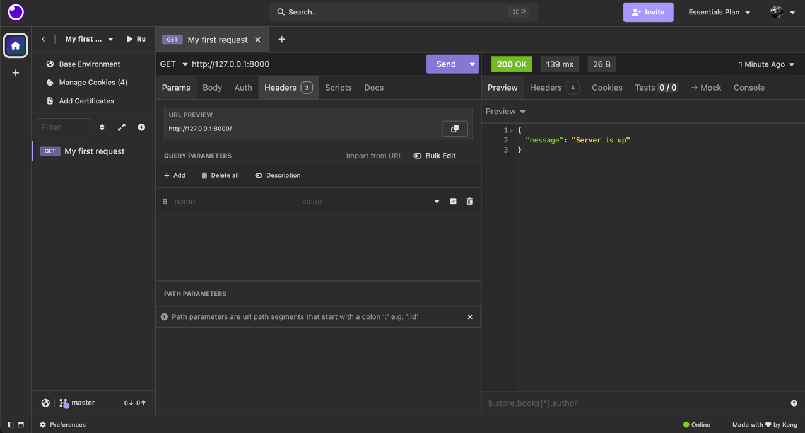
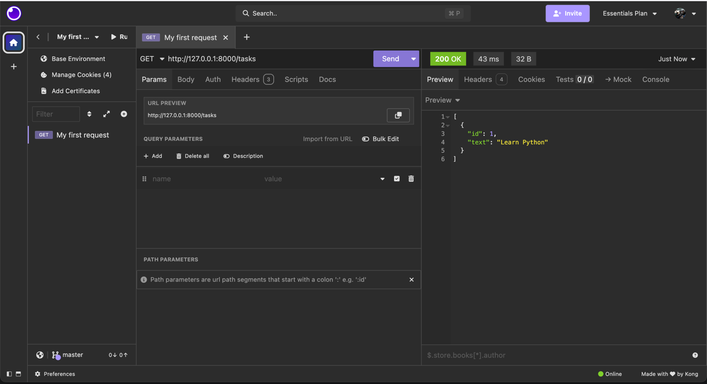

# Веб-приложение на FastAPI

## Описание проекта

В рамках задания реализовано веб-приложение на языке Python с использованием библиотеки FastAPI.
Приложение обрабатывает GET- и POST-запросы и возвращает ответы в формате JSON.

Тема приложения: работа со списком задач.

Реализованы следующие возможности:

- проверка работы сервера;
- получение списка задач;
- добавление новой задачи.

## Используемый инструментарий

- Язык программирования: Python
- Веб-фреймворк: FastAPI
- Валидация входных данных: Pydantic
- HTTP-сервер для запуска: Uvicorn
- Тестирование запросов: Insomnia

## Структура проекта

- `main.py` — основной файл приложения
- `README.md` — описание проекта и демонстрация работы

## Код приложения

```python
from fastapi import FastAPI
from pydantic import BaseModel

app = FastAPI()

class TaskCreate(BaseModel):
    task_name: str

tasks = [{"id": 1, "text":"Learn Python"}]

@app.get("/")
def home():
    return {"message": "Server is up"}

@app.get("/tasks")
def get_tasks():
    return tasks

@app.post("/tasks")
def create_task(task: TaskCreate):
    new_task = {"id": len(tasks) + 1, "text": task.task_name}
    tasks.append(new_task)
    return new_task
```

## Установка и запуск

1. Создать и активировать виртуальное окружение.
2. Установить необходимые библиотеки:

```bash
pip install fastapi uvicorn
```

3. Запустить приложение:

```bash
uvicorn main:app --reload
```

4. После запуска сервер будет доступен по адресу:

```text
http://127.0.0.1:8000
```

## Описание маршрутов

### 1. GET /

Маршрут используется для проверки работы сервера.

Пример ответа:

```json
{
  "message": "Server is up"
}
```

### 2. GET /tasks

Маршрут возвращает текущий список задач.

Пример ответа:

```json
[
  {
    "id": 1,
    "text": "Learn Python"
  }
]
```

### 3. POST /tasks

Маршрут добавляет новую задачу в список.

Пример тела запроса:

```json
{
  "task_name": "Write report"
}
```

Пример ответа:

```json
{
  "id": 2,
  "text": "Write report"
}
```

## Проверка работы в Insomnia

Для демонстрации работы приложения были выполнены запросы через программу Insomnia.

### Скриншот 1. GET /


### Скриншот 2. GET /tasks



### Скриншот 3. POST /tasks


## Вывод

В ходе выполнения задания было разработано веб-приложение на FastAPI, которое обрабатывает GET- и POST-запросы.
Приложение позволяет получать список задач и добавлять новые задачи.
Работа приложения была проверена с помощью Insomnia.
